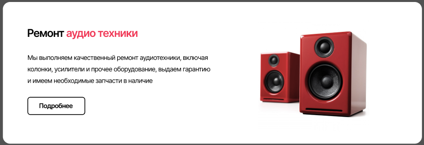
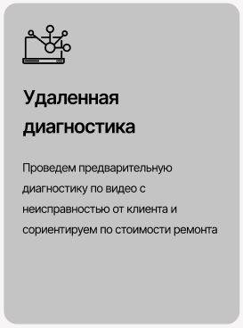
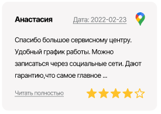

# BEM
head  
head__eye_left  
head__eye_right  
head__nose_big  

hair  
hair_color_blond  
hair_short  
hair_clean  

body  
body__arm_right  
body__arm_left  
body__stomach_big  

legs  
legs__length_short  
legs__width_big  
legs__right_scar_true  

# Emmet
## Header

 

header.header>nav.header__nav>ul.header__list>(li.header__item>a.header__link>img.header__img)+(li.header__item>a.header__link)*5+(li.header__item>a.header__number)

## Form
 

div.repair>(div.repair__wrapper>(h3.repair__title+p.repair__text+form.repair__form>button.repair__button))+img.repair__img

## Card
 

section.services>(div.card>img.card__img+h3.card__title+p.card__text)*3

## Review
 

div.reviews>(div.reviews__info>(p.reviews__name+u.reviews__date+img.reviews__maps))+(p.reviews__text)+(div.reviews__grade>((u>a.reviews__gray)+img.reviews__stars))